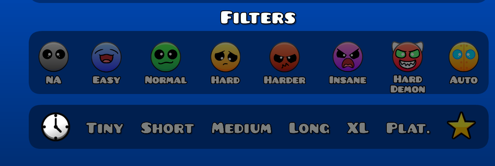
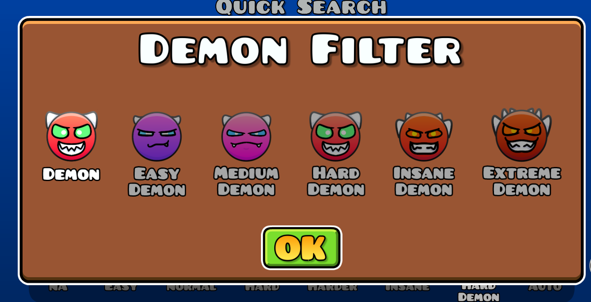

A texture pack for Geometry Dash that alters the Difficulty Faces to make them look cuter!

With mod support for:
<ul>
<li>More Difficulties by Uproxide</li>
</ul>
<h1>Previews</h1>
<h2>v2</h2>

  

    <h2>v1 (LEGACY)</h2>
  

  <b>NOTE</b> - Legacy will continue to recieve updates
  
  ## Legacy has [moved](https://github.com/slackwaree/cute-difficulty-faces-legacy)!

## FAQ

> "It's not appearing in my texture loader after I installed it manually and not via the Texture Pack Workshop"

Unzip the contents of the file and remove `pack.json`.

> "Will you add support for XYZ?"

It depends on the popularity of a given mod. Mod downloads are what I take into account when I consider mod popularity. **I will not be adding support for Demons In between, there's too many textures and the differences between textures are too subtle to be worth it for me.**

> "Can I use these textures as part of my own mod/texture pack?"

Go for it! Please just be courteous and credit me if you can — even if it's just a footnote in a text file. DM me on discord (@realslacc) for full res sprites.

It genuinely warms my heart to know that people like my art, ty <3
